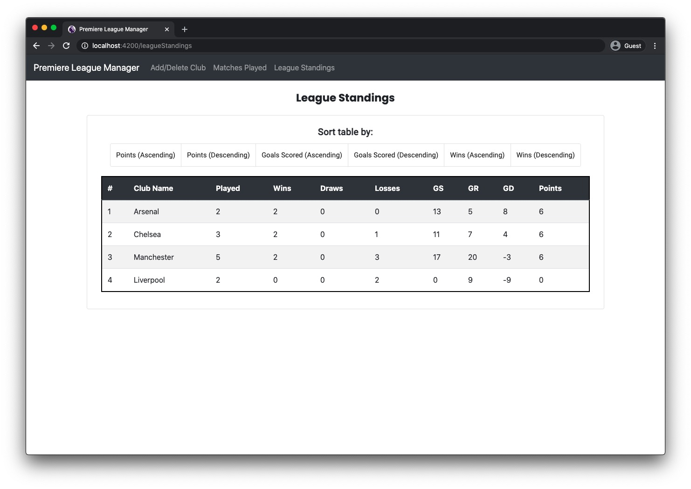
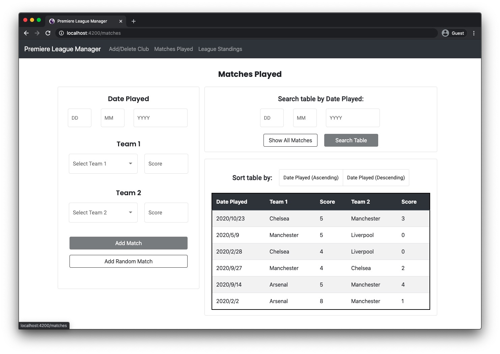
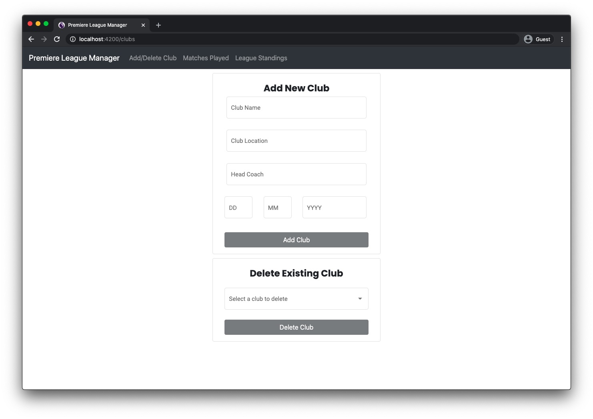

# Premiere League Manager

This repo contains files for the project that was completed under the Object Oriented Programming Module in the 2nd year at IIT. The project consists of both a console application and a GUI which simulates the manipulation of a premier league championship.

Play Framework has been used to develop the web application backend/services and frontend using Angular CLI.

## Screenshots

## Used Versions / Frameworks & Technologies

* [Play Framework: 2.8.0](https://www.playframework.com/documentation/2.8.x/Home)
* [Angular CLI: 10.2.0](https://cli.angular.io/)
* [Angular Reactive Forms](https://angular.io/guide/reactive-forms)
* [Angular Material](https://material.angular.io/)

### Integrated template from: https://github.com/yohangz/java-play-angular-seed

 
 

 
 

[![MIT License][license-badge]][LICENSE]

## Contributors [Integrated template]

<!-- ALL-CONTRIBUTORS-LIST:START - Do not remove or modify this section -->
|[ Yohan Gomez][yohan-profile]| [ Lahiru Jayamanna][lahiru-profile] | [ Gayan Attygalla](https://github.com/Arty26)| [ Anuradha Gunasekara][anuradha-profile]|
| :---: | :---: | :---: | :---: |
<!-- ALL-CONTRIBUTORS-LIST:END -->

## License

This software is licensed under the MIT license

[license-badge]: http://img.shields.io/badge/license-MIT-blue.svg?style=flat
[license]: https://github.com/yohangz/java-play-angular-seed/blob/master/LICENSE

[yohan-profile]: https://github.com/yohangz
[lahiru-profile]: https://github.com/lahiruz
[gayan-profile]: https://github.com/Arty26
[anuradha-profile]: https://github.com/sanuradhag
